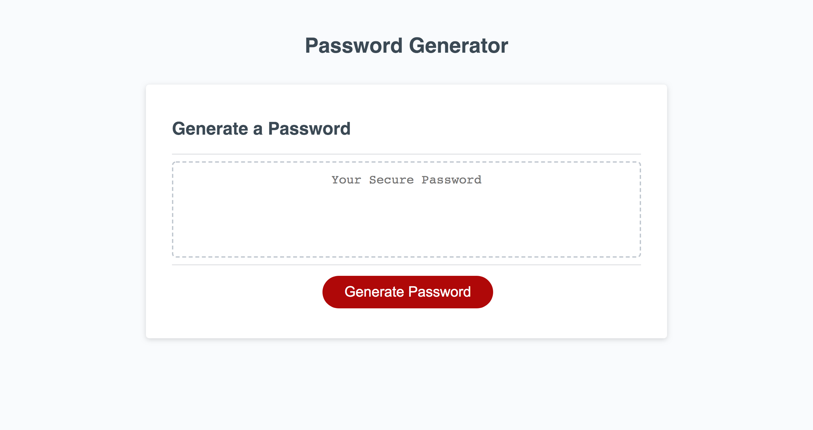

## Password Generator

# Description
[Password Generator](https://jeanarose.github.io/password-generator/) was created to generate a random password when the button "Generate Password" is clicked. The password is dependent on answers to a series of prompts that the user receives when the button is clicked. The user chooses:

* The password length
* Inclusion of lowercase characters
* Inclusion of uppercase characters
* Inclusion of number characters
* Inclusion of special characters 

A password is generated based on the user's chosen criteria. Checks were also put in place to ensure that the user 1) had to input a number for the password length and 2) had to choose at least one kind of password character.

Password Generator utilized functions, variables, prompts, confirms, conditionals, and a for loop. 

View the deployed application here: https://jeanarose.github.io/password-generator/

# Password Generator

# Table of Contents 
* [Installation](#installation)
* [Usage](#usage)
* [Credits](#credits)
* [License](#license)
* [Features](#features)
* [Tests](#tests)

# Installation

# Usage

# Credits

# License

# Tests
